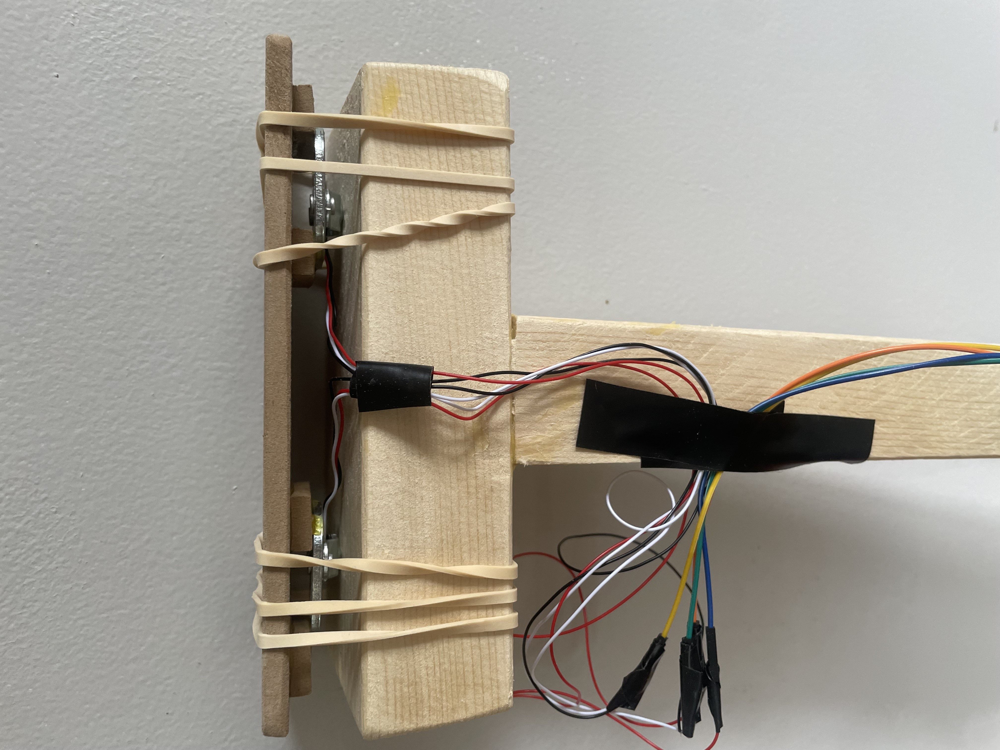
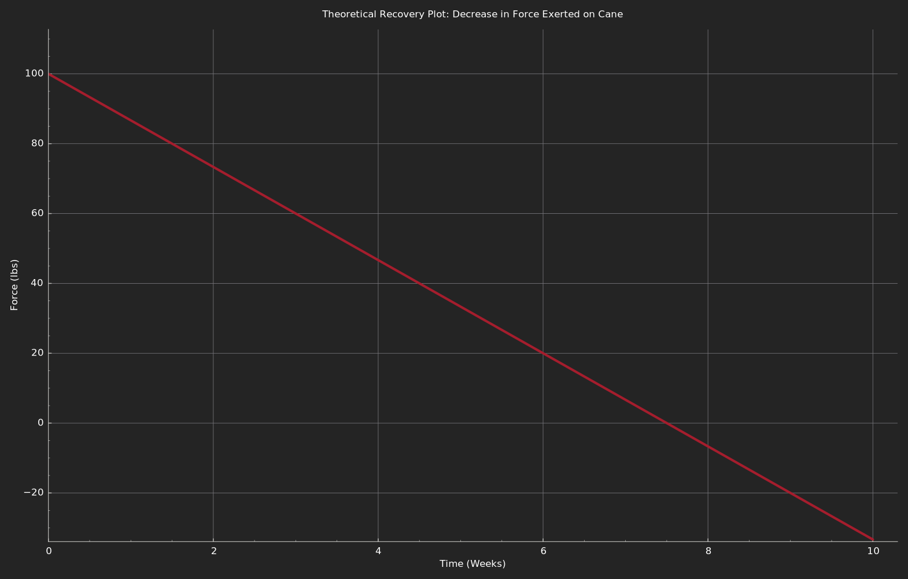

# smart-cane
A smart cane that tracks recovery progress by measuring force exerted over time.

**Smart Cane Project**

In the summer of 2024, during recovery from ACL reconstruction surgery, the idea emerged to create a tool that could assist others facing similar challenges. A smart cane that measures the force exerted over time, enabling users to track their recovery progress.

**Design and Prototyping**

With prior experience using Arduino, research focused on methods to measure force, leading to the discovery of load cells—devices that convert mechanical strain into electrical signals. A wooden prototype was constructed, incorporating load cells into the handle. Initial designs encountered challenges in attaching the load cells securely while maintaining their functionality.
Elastic bands were used to hold the load cells in place, enabling accurate stress measurement. The [HX711](https://github.com/RobTillaart/HX711) repository was integrated to process data from the load cells, with system initialization taring the scale to account for the elastic bands' force.

**Electronics and Integration**

The load cells were connected using a Wheatstone bridge circuit and linked to an Arduino. To power the system, a battery pack was added. However, a need was identified for a memory module to store data for long-term tracking.
At this point my recovery progressed to the point where I could walk fine on my own so I shelved the project, but had it been completed, I would assume the following image is how the data would look.

**Future Development**  
Planned improvements for the next iteration include:
- **Memory Storage**: Incorporating a module to save recovery data over time.
- **Enhanced Design**: Developing a more ergonomic and durable cane.
- **Bluetooth Connectivity**: Adding wireless functionality to sync data with a companion app, enabling visualization of recovery progress and additional metrics like heart rate.
- **Monetization**: Offering a subscription-based app with advanced analytics and tracking features for users.

